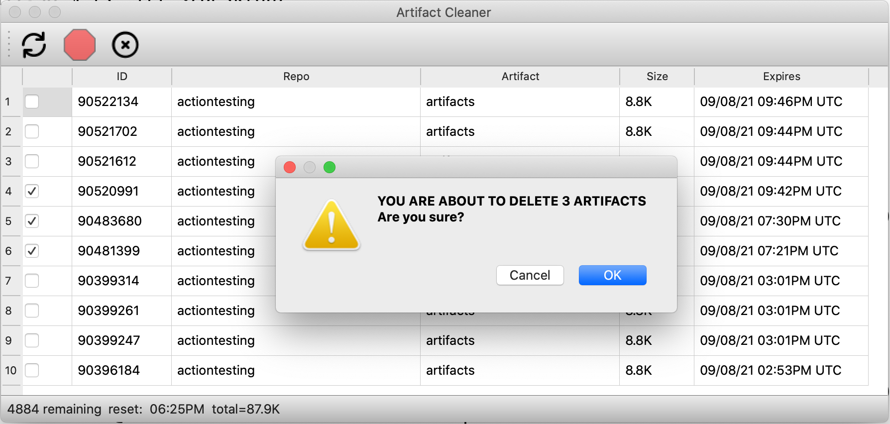

|File   | Purpose|
| ----- | ------ |
|octocat.py| Renders the github mascot as ascii art with a custom message|
|artifactcleaner.py|PyQt5 GUI tool that scans your repos for artifacts and lists them for possible deletion.<BR><BR>Handy for keeping your storage costs down|
|workflow_list.py | simple list of workflows|
|issuelister.py|produce a CSV list of issues for a repo<br>Handy for collecting hero stats for the boss|


# Artifact Cleaner

Usage:
```bash
python3 --owner <owner> --token <GITHUB_TOKEN>
```




## Credits
- Refresh Icon By: https://icons-for-free.com/refresh+icon-1320183705440102854/
- X icon by: https://icons-for-free.com/icon+x+icon-1320183702540076171/![<Display Name>](